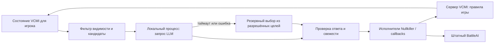

# LLM-противник для Heroes III / VCMI на macOS M4

Дата исследования: **2 октября 2026 года**. Статус: исследование исходников и проект MVP, без реализации, сборки движка и запуска платных запросов.

## 1. Решение, которое поддерживает исследование

**Проект технически осуществим.** LLM может выбирать стратегические цели, а VCMI — строить пути, выполнять игровые команды и вести сражения. Готовой интеграции «LLM отдаёт цель штатному Nullkiller» в проверенном коде нет: потребуется собственный адаптер внутри AI-модуля.

Рекомендуемый первый вариант: **зафиксировать VCMI 1.7.5, собрать отдельный нативный adventure-AI модуль с небольшой адаптацией исходников Nullkiller2 и подключить локальный процесс, который вызывает Responses API**. Боевой AI — штатный BattleAI. Это позволяет проверить гипотезу без изменения правил и серверной логики движка. Совместимость модуля со скачанным приложением ещё должна быть доказана сборкой и загрузкой; наличие интерфейса не равнозначно проверенной бинарной совместимости.

Здесь существенна версия:

| Основа | Что подтверждено | Следствие |
| --- | --- | --- |
| Последний опубликованный релиз **1.7.5**, 15 августа 2026; commit `6901839ae9760dfcd1d5ff2c4aa4ef6968fee752` | Есть динамическая загрузка AI-библиотек | Отдельный AI-плагин возможен на уровне исходников; обычного контентного мода недостаточно |
| Текущая default-ветка **develop**, проверенный commit `185ef7ec25a981daee10aeb54835a10351c28a6e`, 2 октября 2026 | AI включены в общую библиотеку, создание по имени через AIFactory | Новый AI требует регистрации и собственной сборки VCMI; внешнюю dylib фабрика не подхватит |

Источники: [релиз 1.7.5](https://github.com/vcmi/vcmi/releases/tag/1.7.5), [загрузчик релиза](https://github.com/vcmi/vcmi/blob/6901839ae9760dfcd1d5ff2c4aa4ef6968fee752/lib/callback/CDynLibHandler.cpp), [фабрика develop](https://github.com/vcmi/vcmi/blob/185ef7ec25a981daee10aeb54835a10351c28a6e/lib/callback/AIFactory.cpp), [сборка общей библиотеки](https://github.com/vcmi/vcmi/blob/185ef7ec25a981daee10aeb54835a10351c28a6e/libFacade/CMakeLists.txt).

**Оценка:** инженерный MVP и начальная сравнительная проверка — около **28–45 рабочих дней одного разработчика**, знакомого с C++ и интеграцией API. Это оценка работ, а не результат эксперимента; разработка сильного универсального противника выходит за этот диапазон. Победу над Nullkiller заранее обещать нельзя.

## 2. Как проверялись источники

Исходники VCMI клонированы и прочитаны локально; отдельно получен tag 1.7.5. Ссылки на код ниже закреплены за commit, чтобы дальнейшие изменения веток не меняли основание выводов. GitHub API использован для проверки последнего релиза, состояния issue и дат обновлений связанных проектов. Для OpenAI прочитана актуальная официальная документация.

Предположения из предыдущего обсуждения не использовались. Ни сборка arm64, ни реальная партия, ни качество LLM, ни конкретные права аккаунта Pro в этом исследовании не проверялись. «Есть в коде» и «работает на данном Mac» здесь разделены.

## 3. Конкретные интерфейсы и точки подключения

### 3.1. Adventure AI и боевой AI

| Файл / класс | Что предоставляет | Как использовать |
| --- | --- | --- |
| [CGameInterface.h](https://github.com/vcmi/vcmi/blob/185ef7ec25a981daee10aeb54835a10351c28a6e/lib/callback/CGameInterface.h), `CGameInterface` | `initGameInterface`, `yourTurn(QueryID)`, обработчики выбора, гарнизона, телепортации, завершения | Жизненный цикл AI игрока; нельзя реализовать только yourTurn и забыть обязательные ответы на игровые запросы |
| [CGlobalAI.h](https://github.com/vcmi/vcmi/blob/185ef7ec25a981daee10aeb54835a10351c28a6e/lib/callback/CGlobalAI.h), `CGlobalAI` | Основа AI-интерфейса, Environment | База собственного модуля |
| [CAdventureAI.h](https://github.com/vcmi/vcmi/blob/6901839ae9760dfcd1d5ff2c4aa4ef6968fee752/lib/callback/CAdventureAI.h) и [CAdventureAI.cpp](https://github.com/vcmi/vcmi/blob/6901839ae9760dfcd1d5ff2c4aa4ef6968fee752/lib/callback/CAdventureAI.cpp), `CAdventureAI` | `getBattleAIName()`; пересылка battle-событий отдельному боевому AI | Возвращать `BattleAI`, сохранять обычный ход боя без LLM |
| [AIGateway.h](https://github.com/vcmi/vcmi/blob/6901839ae9760dfcd1d5ff2c4aa4ef6968fee752/AI/Nullkiller2/AIGateway.h), `NK2AI::AIGateway` | Игровые события, queries, AsyncRunner, AIStatus, callback, Nullkiller | Переиспользовать обработку движения, битв и диалогов в адаптированном модуле |
| [AIGateway.cpp](https://github.com/vcmi/vcmi/blob/6901839ae9760dfcd1d5ff2c4aa4ef6968fee752/AI/Nullkiller2/AIGateway.cpp), `yourTurn` / `makeTurn` | Подтверждает начало хода, запускает работу асинхронно, вызывает Nullkiller, заканчивает ход | Подключить стратегический цикл внутри владельца AI-хода |
| [BattleAI.cpp](https://github.com/vcmi/vcmi/blob/6901839ae9760dfcd1d5ff2c4aa4ef6968fee752/AI/BattleAI/BattleAI.cpp), `CBattleAI` | Выбор тактических действий | Общий боевой AI для экспериментального противника и контрольного Nullkiller |

В релизе [AI/Nullkiller2/main.cpp](https://github.com/vcmi/vcmi/blob/6901839ae9760dfcd1d5ff2c4aa4ef6968fee752/AI/Nullkiller2/main.cpp) экспортирует `GetGlobalAiVersion`, `GetAiName`, `GetNewAI`. `CDynLibHandler::getNewAI` ищет библиотеку через `VCMIDirs::fullLibraryPath("AI", name)`, вызывает `dlopen` / `dlsym` на не-Windows платформе. [CMakeLists.txt модуля](https://github.com/vcmi/vcmi/blob/6901839ae9760dfcd1d5ff2c4aa4ef6968fee752/AI/Nullkiller2/CMakeLists.txt) действительно создаёт SHARED target при выключенном `ENABLE_STATIC_LIBS`.

Однако экспорт с `extern "C"` не делает интерфейс независимым от C++ ABI: через него передаются `std::shared_ptr<CGlobalAI>` и объект с виртуальными методами. Плагин нужно собирать против точного релиза и совместимых зависимостей/toolchain. Нельзя считать его универсальной библиотекой для любой VCMI.

### 3.2. Состояние игрока и команды

[CClient::installNewPlayerInterface](https://github.com/vcmi/vcmi/blob/6901839ae9760dfcd1d5ff2c4aa4ef6968fee752/client/Client.cpp) создаёт `CCallback` с конкретным `PlayerColor`. Это нужная граница наблюдения; callback без привязки к игроку для LLM использовать нельзя.

| Граница | Файлы и методы | Проверенный смысл |
| --- | --- | --- |
| Информация | [CGameInfoCallback.cpp](https://github.com/vcmi/vcmi/blob/6901839ae9760dfcd1d5ff2c4aa4ef6968fee752/lib/callback/CGameInfoCallback.cpp): `getObj`, `getTile`, `isVisible`, `getHeroInfo`, `getTownInfo` | Часть методов проверяет видимость и доступ; информация о чужом герое/городе зависит от уровня доступных сведений |
| Свои объекты | [CPlayerSpecificInfoCallback.cpp](https://github.com/vcmi/vcmi/blob/6901839ae9760dfcd1d5ff2c4aa4ef6968fee752/lib/callback/CPlayerSpecificInfoCallback.cpp): `getHeroesInfo`, `getTownsInfo`, ресурсы через callbacks | Основа для своего героя, города и экономики |
| Уровень раскрытия армии | [InfoAboutArmy.h/.cpp](https://github.com/vcmi/vcmi/blob/185ef7ec25a981daee10aeb54835a10351c28a6e/lib/gameState/InfoAboutArmy.h), `ArmyDescriptor`, `InfoAboutHero`, `InfoAboutTown` | Для неполной информации количества представлены категориями; нельзя подменять их точными размерами чужих стеков |
| Действия | [IGameActionCallback.h](https://github.com/vcmi/vcmi/blob/185ef7ec25a981daee10aeb54835a10351c28a6e/lib/callback/IGameActionCallback.h), [CCallback.cpp](https://github.com/vcmi/vcmi/blob/6901839ae9760dfcd1d5ff2c4aa4ef6968fee752/lib/callback/CCallback.cpp) | `moveHero`, `buildBuilding`, `recruitCreatures`, `selectionMade`, `sendQueryReply`, `endTurn`, `save`, `saveLocalState` |
| Пакеты | [PacksForServer.h](https://github.com/vcmi/vcmi/blob/185ef7ec25a981daee10aeb54835a10351c28a6e/lib/networkPacks/PacksForServer.h) | `MoveHero`, `BuildStructure`, `RecruitCreatures`, `EndTurn`, `SaveLocalState` |
| Проверка сервером | [NetPacksServer.cpp](https://github.com/vcmi/vcmi/blob/185ef7ec25a981daee10aeb54835a10351c28a6e/server/NetPacksServer.cpp), `ApplyGhNetPackVisitor` | Проверяет игрока/владельца и активный ход, затем вызывает обработчик действия |
| Правила перемещения | [CGameHandler::moveHero](https://github.com/vcmi/vcmi/blob/185ef7ec25a981daee10aeb54835a10351c28a6e/server/CGameHandler.cpp) | В стандартном режиме проверяются соседство, стоимость движения, доступность и игровые ограничения |

`CCallback::moveHero` отправляет команду движения, а не реализует универсальное стратегическое «дойди до объекта через несколько дней». Путь и исполнение последовательности остаются работой AI. Для MVP нужны штатные pathfinder и исполнители, а не новые правила перемещения.

Возвращаемое значение callback нельзя трактовать как достижение цели. Например, движение может законно прерваться на query после части пути. Проверять нужно подтверждение запроса и обновлённое состояние: позицию, владение объектом, остаток движения, завершение боя. Повторять отправленную команду только из-за сетевого таймаута нельзя.

### 3.3. Что именно есть у Nullkiller

[Engine/Nullkiller.h](https://github.com/vcmi/vcmi/blob/6901839ae9760dfcd1d5ff2c4aa4ef6968fee752/AI/Nullkiller2/Engine/Nullkiller.h) содержит виртуальный `makeTurn`, pathfinder, decomposer, анализаторы и gateway. Но `resetState`, `updateState`, `decompose`, `executeTask` находятся в private; штатный `makeTurn` сам выбирает поведение. Это не готовый публичный интерфейс внешнего планировщика.

Внутренний маршрут выглядит так:

1. [Nullkiller::makeTurn](https://github.com/vcmi/vcmi/blob/6901839ae9760dfcd1d5ff2c4aa4ef6968fee752/AI/Nullkiller2/Engine/Nullkiller.cpp) сбрасывает состояние, обновляет анализаторы, генерирует и оценивает задачи.
2. `updateStateAndExecutePriorityPass` **уже выполняет** найм героя, покупку армии и строительство. Поэтому замена только последнего выбора цели оставит экономику под управлением Nullkiller.
3. [CaptureObject::decompose](https://github.com/vcmi/vcmi/blob/6901839ae9760dfcd1d5ff2c4aa4ef6968fee752/AI/Nullkiller2/Goals/CaptureObject.cpp) передаёт цель в `CaptureObjectsBehavior`.
4. [CaptureObjectsBehavior](https://github.com/vcmi/vcmi/blob/6901839ae9760dfcd1d5ff2c4aa4ef6968fee752/AI/Nullkiller2/Behaviors/CaptureObjectsBehavior.cpp) использует доступные AI-пути и формирует задачи.
5. [ExecuteHeroChain::accept](https://github.com/vcmi/vcmi/blob/6901839ae9760dfcd1d5ff2c4aa4ef6968fee752/AI/Nullkiller2/Goals/ExecuteHeroChain.cpp) выполняет путь, специальные действия и перемещения через gateway.
6. [AIGateway::moveHeroToTile](https://github.com/vcmi/vcmi/blob/6901839ae9760dfcd1d5ff2c4aa4ef6968fee752/AI/Nullkiller2/AIGateway.cpp) идёт по пути, ждёт окончания движения/битвы/query и проверяет сохранность героя.
7. [BuildThis::accept](https://github.com/vcmi/vcmi/blob/6901839ae9760dfcd1d5ff2c4aa4ef6968fee752/AI/Nullkiller2/Goals/BuildThis.cpp) проверяет `canBuildStructure`; [BuyArmy::accept](https://github.com/vcmi/vcmi/blob/6901839ae9760dfcd1d5ff2c4aa4ef6968fee752/AI/Nullkiller2/Goals/BuyArmy.cpp) выполняет покупку армии по внутренней логике.

**Можно переиспользовать этот механизм, но потребуется изменить исходники своего AI-модуля.** Нет подтверждённого метода наподобие `submitExternalGoal(JSON)`, очереди внешних целей или штатного RPC для них. Подкласс с override makeTurn сам по себе не открывает private этапы планирования и подготовки.

Минимальная адаптация: разделить получение кандидатов и их исполнение в копии/производной версии модуля, поставить выбор LLM перед исполнением экономических и приключенческих задач, сохранить штатные исполнители. Перед отправкой модели фильтровать по заданному герою и городу. В `performObjectInteraction` отдельно учесть автоматические улучшения войск и покупку spellbook: это экономические расходы, а не только перемещение. В строгом MVP такие расходы должны входить в разрешённый макрошаг либо быть исключены.

## 4. Мод, плагин или форк

| Подход | Возможность | Ограничения |
| --- | --- | --- |
| Обычный мод с JSON, картами и ресурсами | Полезен для карты MVP и конфигурации | В проверенном пути создания adventure-AI не устанавливает новый LLM-планировщик; одного mod.json недостаточно |
| Отдельная AI-библиотека на 1.7.5 | **Подтверждена исходниками загрузчика и CMake** | Нативная arm64 библиотека, зависимости, ABI, расположение AI-библиотек, подпись пакета; установка не равна установке контентного мода |
| Плагин, который просто отдаёт цели уже загруженному Nullkiller | **Готового интерфейса нет** | Нужно адаптировать исходники Nullkiller внутри собственного модуля; динамически найденные внутренние C++ символы — ненадёжное основание |
| Новый встроенный AI в develop | Возможен | Добавить target и имя в AIFactory, сборочную агрегацию и нужные настройки; понадобится собственная сборка/патч VCMI |
| Внешний процесс без нативного адаптера | Не подтверждён как готовая возможность | Существующие игровые сетевые пакеты не являются готовым JSON API для стратегического агента |

**Рекомендация:** не делать общий TCP/WebSocket command server для всего движка. Для исследования достаточно исходящего локального канала из AI-модуля в LLM-процесс. Для будущей поддержки develop переносить этот же стратегический цикл во встроенный модуль. Это небольшой поддерживаемый патч, а не необходимость переписывать движок или менять правила игры.

## 5. MMAI, VCMI Gym и issue #5586

### MMAI

MMAI — уже интегрированный **боевой** AI с предобученными моделями, впервые выпущенный как экспериментальная возможность в VCMI 1.7.0. В проверенном develop есть [BAI::Router](https://github.com/vcmi/vcmi/blob/185ef7ec25a981daee10aeb54835a10351c28a6e/AI/MMAI/BAI/router.cpp), [загрузка ONNX-модели](https://github.com/vcmi/vcmi/blob/185ef7ec25a981daee10aeb54835a10351c28a6e/AI/MMAI/BAI/factory.cpp), [схема v13](https://github.com/vcmi/vcmi/blob/185ef7ec25a981daee10aeb54835a10351c28a6e/AI/MMAI/schema/v13/schema.h). Router выбирает модель по стороне и siege-контексту; при отсутствии подходящей модели предусмотрен scripted fallback. Это подтверждает реальное исполнение модели в игре, но не универсальную надёжность боевого AI и не наличие глобальной стратегии.

Отдельный [репозиторий мода MMAI](https://github.com/vcmi-mods/mmai) поставляет модели/настройки. В проверенной default-ветке commit `44b6654a551e180e916427851ea5e69136d20fba` от 5 августа 2026 [mod.json](https://github.com/vcmi-mods/mmai/blob/44b6654a551e180e916427851ea5e69136d20fba/mmai/mod.json) объявляет версию 3.0.0, Graphmind/v15 и совместимость 1.8.0–1.8.9. При этом проверенная фабрика VCMI develop обрабатывает v13. **Объявление v15 в моде не доказывает, что оно работает с выбранным движком.** Для 1.7.5 нужен совместимый вариант из линии 1.7; для MVP проще использовать BattleAI. Новейший мод и новейшая ветка движка не образуют автоматически совместимую пару.

### VCMI Gym

[VCMI Gym](https://github.com/smanolloff/vcmi-gym) — активно разрабатываемая RL-среда для боя. Проверенный commit `caf075ae0d2e6dfb6fe73b2bc2e094691d247502` от 24 сентября 2026. [VcmiEnv v15](https://github.com/smanolloff/vcmi-gym/blob/caf075ae0d2e6dfb6fe73b2bc2e094691d247502/vcmi_gym/envs/v15/vcmi_env.py) реализует Gymnasium observation/action пространства; [connector](https://github.com/smanolloff/vcmi-gym/blob/caf075ae0d2e6dfb6fe73b2bc2e094691d247502/doc/connector.md) связывает Python-среду и C++ с синхронизацией потоков.

README прямо предупреждает, что инструкции установки устарели и не работают; нужен специальный fork VCMI для обучения. [git submodule](https://github.com/smanolloff/vcmi-gym/blob/caf075ae0d2e6dfb6fe73b2bc2e094691d247502/.gitmodules) указывает на smanolloff/vcmi. Это полезный пример state/action разделения, но не готовая среда управления глобальной картой. [Авторский журнал](https://smanolloff.github.io/projects/vcmi-gym/) относит adventure-AI к отдельному будущему проекту; результаты тренировок боевых моделей нельзя переносить на качество стратегии LLM.

### Issue #5586

[LLM Learning Game Integration with VCMI, #5586](https://github.com/vcmi/vcmi/issues/5586) на дату проверки **открыт**, создан 25 марта 2025, последнее обновление 13 июня 2026, четыре комментария. В обсуждении предложены JSON-состояние, внешний command server и Python-обвязка. Страница не показывает связанные ветки/PR. Это запрос на возможность, а не реализованный контракт. По проверенным AI-интерфейсам нельзя считать предложенные `move_hero` и `recruit_troops` существующими внешними командами.

## 6. Минимальная архитектура



Все новые названия в этом разделе — проектируемые компоненты, а не уже существующие классы VCMI.

### 6.1. Наблюдение и туман войны

Передавать DTO со своими ресурсами, своим героем/армией/движением, своим городом/строительством/наймом, открытой территорией, доступными сведениями о встреченных объектах и короткой памятью прежних наблюдений. Чужая армия — только с тем уровнем точности, который разрешён интерфейсом игрока; Visions и иные законные источники сведений учитывать отдельно. Не сериализовать игровые указатели и весь CGameState.

`getObj` фильтрует видимость объекта, но возвращённый указатель может содержать точные поля, недоступные человеку. Поэтому применять `getHeroInfo` / `getTownInfo` и эквивалентные представления информации об армии, а не автоматически выгружать все поля CGHeroInstance/CGTownInstance.

Фильтровать надо **и состояние, и кандидаты, и их оценки**: координата скрытого города, точная сила неизвестной армии или pathfinding-стоимость через неизвестную территорию тоже могут раскрыть информацию. Разведка задаётся границей известной территории; неизвестная клетка остаётся unknown до законного открытия. Память содержит только записанное наблюдение и день наблюдения; никаких обновлений скрытого противника из живых объектов.

Для всех участников выключить `cheatsAllowed`, `openMap`, `allowObjectGraph` и не вызывать раскрывающие карту cheats. [Nullkiller::init](https://github.com/vcmi/vcmi/blob/6901839ae9760dfcd1d5ff2c4aa4ef6968fee752/AI/Nullkiller2/Engine/Nullkiller.cpp) связывает open-map с разрешением cheats, а [AIGateway::cheatMapReveal](https://github.com/vcmi/vcmi/blob/185ef7ec25a981daee10aeb54835a10351c28a6e/AI/Nullkiller2/AIGateway.cpp) может отправить `vcmieagles`. В develop [ExplorationHelper](https://github.com/vcmi/vcmi/blob/185ef7ec25a981daee10aeb54835a10351c28a6e/AI/Nullkiller2/Helpers/ExplorationHelper.cpp) содержит `getTileUnchecked` в оценке продолжения Dimension Door. Это конкретная причина не обещать строгую информационную изоляцию всех помощников Nullkiller по одной проверке callback.

**Требование MVP:** запретить adventure movement spells и сложные объекты, провести аудит используемого подмножества помощников. Проверка невидимого состояния: две партии с одинаковым наблюдением, но разными скрытыми объектами должны давать одинаковые DTO и кандидаты до открытия этих различий. Тестировать также выполнение и резервный выбор; фильтр JSON сам по себе не доказывает соблюдение тумана войны.

### 6.2. Структурированное решение

Модель выбирает из ограниченного списка **стратегических макроцелей**, рассчитанного адаптером:

- построить одно из разрешённых зданий;
- выполнить объявленный пакет найма/пополнения армии;
- посетить/захватить известный объект;
- вернуться в город;
- разведать одну из доступных границ;
- завершить ход.

Каждый кандидат содержит opaque action_id, привязку к герою/городу, смысл, разрешённую информацию о риске, стоимость/диапазон затрат и условия завершения. Маршрут, отдельные шаги и бой не выбирает LLM. Ограничение количества кандидатов не должно всегда повторять top-1 Nullkiller: иначе эксперимент почти не измеряет стратегию LLM. На MVP показывать все допустимые цели небольшого сценария либо обеспечивать покрытие каждого типа.

Пример **проектируемого** ответа:

```json
{
  "schema_version": 1,
  "observation_id": "game17:red:day4:step2",
  "action_id": "capture_mine_23_by_hero_8",
  "intent": "Обеспечить древесину для дальнейшего строительства"
}
```

action_id разрешается только в таблице кандидатов данного наблюдения. intent служит для объяснения; исполняется исключительно action_id. Никакого произвольного кода, имён методов, сырых пакетов и свободных координат от LLM.

Один запрос на значимый стратегический выбор, максимум первоначально **3 запроса за ход**. После раскрытия новой информации/боя/исчерпания цели — обновление наблюдения и, в пределах бюджета, новый выбор. Это проектируемый предел; длительность реальной партии нужно измерить.

### 6.3. Проверка и исполнение

Проверять JSON/schema, observation_id, существование кандидата, активность игрока, владение, сохранность героя, видимость цели, остаток движения, доступность пути, ресурсы и building/army constraints. Перед каждым исполнением повторно получить объекты по ID и актуальные условия; указатели и готовые AIPath не сохранять через ожидание LLM.

Исполнять последовательно в существующем AI worker. Не держать `CGameState::mutex` или aiStateMutex во время HTTP-запроса: штатный gateway держит shared lock внутри makeTurn, поэтому ожидание сети нужно вынести из этой области. Кратко снять DTO/кандидаты под защитой состояния, освободить блокировки, дождаться модели, восстановить актуальный контекст и проверить решение.

Queries, level-up и battle-события должны продолжать обрабатываться. Не блокировать network/event поток ожиданием LLM. Передачу войск, ответы на обычные диалоги и автоматические расходы сделать частью явного ограниченного макрошага. Недопустимое действие отклоняет адаптер; сервер остаётся последней проверкой игровых правил.

### 6.4. Таймауты и резервный AI

Предлагаемые стартовые значения: **20 секунд на решение**, **60 секунд суммарного ожидания LLM за ход**, не более одной повторной попытки при временном сбое и только внутри общего лимита. SDK retries должны быть явными, чтобы незаметные повторы не превысили срок/бюджет.

На timeout, отказ модели, неполный ответ, 429, недоступность сети или invalid action — резервный детерминированный выбор из того же разрешённого списка, затем штатный исполнитель. Для первого MVP достаточно простого порядка: безопасное пополнение/разрешённое строительство → достижимый полезный объект → разведка → end_turn. При отсутствии допустимых целей закончить ход.

**Не запускать второй полноценный AIGateway/Nullkiller параллельно для того же игрока.** У него собственные queries, события и endTurn. Штатный стратегический ранжировщик можно использовать как резерв после аудита, но полный Nullkiller может нанять лишнего героя, потратить ресурсы и использовать более подробные сведения. Поэтому начальный fallback ограничен тем же DTO и областью управления. Долю fallback обязательно измерять: высокая доля означает, что результат преимущественно получен резервным AI.

При загрузке другой партии, окончании хода или завершении игры отменить ожидание, сменить generation ID и игнорировать поздний ответ. Пока запрос ещё не закончен, fallback получает исключительное право продолжить ход. Недоступность модуля при старте — отдельный случай: нужен запуск с обычным Nullkiller через конфигурацию, а не обещание, что сломанный плагин сам себя заменит.

### 6.5. Сохранение партии

Переиспользовать `CCallback::saveLocalState(JsonNode)` и `PlayerState::playerLocalSettings`, которое [сериализуется с игроком](https://github.com/vcmi/vcmi/blob/6901839ae9760dfcd1d5ff2c4aa4ef6968fee752/lib/CPlayerState.h). [Сервер](https://github.com/vcmi/vcmi/blob/6901839ae9760dfcd1d5ff2c4aa4ef6968fee752/server/NetPacksServer.cpp) записывает этот JSON. API заменяет весь playerLocalSettings, поэтому сохранять структуру с namespace экспериментального AI, а не затирать другие поля.

Хранить версию схемы, IDs подконтрольных объектов, текущую стратегическую цель, память разрешённых наблюдений и расход бюджета. Обычный игровой save сохраняет уже принятые игровые действия. Перед запросом и после завершения макрошага записывать актуальное AI-состояние в безопасной точке и проверять read-back при загрузке.

На resume не продолжать старый HTTP-запрос и не считать прежний action_id действительным: создать новое наблюдение, проверить цель и построить путь заново. Если AI-данные отсутствуют/несовместимы — восстановить наблюдаемое состояние и перейти к резервному выбору. Ключ API/OAuth и полная цепочка диалога не входят в save. Внешний журнал решений нужен для экспериментов, но не должен быть необходим для продолжения партии. Совместимость saves между версиями движка не обещается: MVP закрепляет один релиз.

## 7. macOS / Apple Silicon M4

Официальный релиз содержит **VCMI-macOS-arm.dmg** отдельно от Intel. [Инструкция сборки macOS](https://github.com/vcmi/vcmi/blob/185ef7ec25a981daee10aeb54835a10351c28a6e/docs/developers/Building_macOS.md) предусматривает профиль Conan `macos-arm`, CMake и Apple toolchain; [CMake проекта](https://github.com/vcmi/vcmi/blob/185ef7ec25a981daee10aeb54835a10351c28a6e/CMakeLists.txt) использует C++20. M4 относится к arm64-цели; специальной модели LLM для M4 при облачном inference не требуется.

На этапе загрузочного эксперимента проверить: архитектуру всех библиотек, runtime-пути зависимостей, путь AI внутри собственного app bundle, code signing/Gatekeeper и совпадение сборочных опций. Для разработки использовать отдельную копию приложения/собственную сборку, не изменять установленную пользовательскую игру. Если загрузка модуля в релизный bundle неудобна, собственная сборка того же 1.7.5 допустима; это ещё не изменение правил ядра.

Игра требует оригинальные игровые данные Heroes III: сборка открытого движка их не создаёт. Использовать отдельные saves/config экспериментального профиля. M4 достаточно рассматривать как поддерживаемую платформу сборки; реальную скорость, память и сетевую задержку здесь не измеряли. Для боёв MVP не нужны тренировки RL, PyTorch/Metal или ONNX Runtime.

## 8. OpenAI: API отдельно и ChatGPT Pro

**Наличие Pro не означает, что обращения по Platform API key включены в подписку.** Официальная [документация аутентификации](https://learn.chatgpt.com/docs/auth) различает ChatGPT sign-in с доступом по подписке и API key с оплатой использования через Platform.

| Вариант | Доступ и ограничения | Пригодность |
| --- | --- | --- |
| **Responses API + Platform API key** | Отдельный Platform billing; тариф модели, account/tier rate limits; поддерживаемые параметры зависят от модели | Рекомендуемый основной транспорт MVP и массовых сравнительных запусков: прямой запрос состояния и структурированного решения |
| **Локальный Codex с ChatGPT Pro: SDK / exec** | Официальный ChatGPT login; подписочные лимиты и доступные аккаунту модели. `codex exec` допускает JSONL и `--output-schema`; SDK управляет локальными threads | Подходит для личного эксперимента. Использование его как игрового планировщика технически возможно по интерфейсу prompt/output, но игровая специализация официально не обещана |
| **Codex app-server** | Auth, history, streamed events, JSON-RPC; stdio для локального интегрирования. Документация отмечает экспериментальность app-server/WebSocket и отсутствие production-гарантии | Полезен для собственного богатого клиента, избыточен для одного выбора action_id; не нужен как первый транспорт |
| **Sign in with ChatGPT (SIWC), ChatGPT plan usage** | Официально документирован для OSS и локальных приложений; eligible Plus/Pro, отдельное разрешение на Responses-запросы. Preview; платный/удалённый продукт имеет иной путь допуска | Более прямой официальный путь использования плана в локальном игровом приложении, если проект/аккаунт удовлетворяют условиям. Рассматривать как дополнительный транспорт после API-MVP |

Источники для Codex: [SDK](https://learn.chatgpt.com/docs/codex-sdk), [non-interactive mode](https://learn.chatgpt.com/docs/non-interactive-mode), [app-server](https://learn.chatgpt.com/docs/app-server). TypeScript SDK требует Node 18+, Python SDK — Python 3.10+ и включает закреплённый runtime. Вход выполняет пользователь официальным способом; не извлекать токены из интерфейса ChatGPT и не строить интеграцию на недокументированных backend-endpoints.

[SIWC overview](https://developers.openai.com/siwc/token-sharing-open-source) и [quickstart](https://developers.openai.com/siwc/quickstart) описывают запрос разрешения на использование плана отдельно от identity. [Models and inference](https://developers.openai.com/siwc/token-sharing-open-source/models-and-inference) указывает публичный `/v1/responses`, модели доступные выбранному аккаунту, `store:false`, `stream:true`, ожидание завершённого response. Это не даёт произвольному API-ключу оплату через Pro.

[Preview limitations](https://developers.openai.com/siwc/token-sharing-open-source/preview-limitations): история передаётся приложением в каждом HTTP-запросе, без previous_response_id; некоторые параметры, включая max_output_tokens и temperature, не поддерживаются. Для игрового действия доступны function/custom tools; серверные MCP/connectors и ряд hosted tools не доступны. Поэтому контролировать срок и бюджет нужно локально; не предполагать полный паритет с обычным API. На SIWC-пути контракт структурированного действия отдельно проверить коротким интеграционным экспериментом; не переносить автоматически схему API-запроса.

Для Codex-эксперимента изолировать каталог, конфигурацию и инструменты: агент не должен читать карту/save, пользоваться браузером или исполнять команды вместо выбора действия. Нужен только переданный DTO. Наличие подписки не подтверждает конкретную модель, квоту или непрерывную возможность играть. **Точные лимиты вашего Pro и успешное использование модели не проверены.** При исчерпании лимита использовать fallback; не включать незаметно платный API.

Для API применять [Structured Outputs / strict function calling](https://developers.openai.com/api/docs/guides/structured-outputs). Schema ограничивает формат, но не гарантирует законность/разумность хода. Отказ, incomplete output и сетевые сбои обрабатывать отдельно. Сначала функция возвращает предложение, затем адаптер валидирует и исполняет его.

### Расходы

Пример расчёта, а не рекомендация модели по качеству: текущая страница [GPT-5.6 Luna](https://developers.openai.com/api/docs/models/gpt-5.6-luna) показывает $0.20 за 1M входных токенов, $0.02 за cached input и $1.20 за 1M output. На странице также есть отдельные условия длинных запросов и cache writes; для малого MVP длинный контекст не нужен.

При 10 000 uncached input и 500 **всего оплачиваемых** output tokens: `0.01 × $0.20 + 0.0005 × $1.20 = $0.0026` за решение. 100 решений ≈ $0.26; 300 ≈ $0.78. Это расчёт без дополнительных инструментов/cache writes; reasoning, повторы и большее наблюдение изменят сумму. Цена не доказывает качество игрового планирования. Модель для основного теста выбирать по пилоту на зафиксированных наблюдениях.

Формула партии: сумма по всем запросам `(uncached_input × P_in + cached_input × P_cache + billed_output × P_out) / 1e6`, плюс применимые дополнительные тарифы. Сохранять фактический usage каждого запроса. Для Pro логировать количество запросов, доступную информацию о расходе лимита и отказы; не приравнивать их к бесплатному безлимитному API и не выдумывать цену в долларах за ход.

## 9. MVP: один город, один герой

Проектируемый сценарий: небольшая карта S, наземный одноуровневый участок, один фиксированный тип города и герой у LLM-стороны; ресурсы, несколько шахт, нейтральные стражи и один противник Nullkiller. Один герой/город — область управления LLM. Для контролируемого первого сценария не должно быть способов получить второго героя; запретить Tavern/найм и лишние города в области LLM. Победа — штатное условие сценария, например победа над обозначенным вражеским героем; пригодность выбранного условия проверить в редакторе на этапе 0. Это предложение карты, она ещё не создана.

В первой версии LLM отвечает за выбор здания, заявленного пакета найма, объекта/направления разведки, возвращение и окончание хода. Уровни героя, перестановка войск и обычные query-ответы — существующая детерминированная логика в пределах макрошага. Сражения — BattleAI; цель «атаковать известную армию» является стратегической, каждый тактический ход выбирает BattleAI.

На тестовой карте исключить море, телепорты, Dimension Door/Town Portal/Fly, сложные quests и расширяющие правила моды. Это сокращение пространства первого эксперимента, а не обещание поддержки этих механик. Позже добавлять их по одному. Не отключать правила боя/движения и не начислять дополнительные ресурсы LLM-стороне.

При потере единственного героя, города или выполнении условия победы сценарий заканчивается по его правилам. Не добавлять скрытую автоматическую замену героя. С самого начала обрабатывать внешние изменения и удаление объекта, даже на малой карте.

Критерии работающего MVP: полная партия заканчивается без зависания; есть решения LLM и их исполнение; данные/кандидаты не раскрывают запрещённую информацию; engine не принимает незаконные запросы; timeout/fallback/save-load проверены; известны число вызовов, задержки и стоимость. Превосходство над Nullkiller — следующий измеряемый результат, а не обязательное предположение реализации.

## 10. Как сравнивать с Nullkiller

Использовать тот же закреплённый движок, карту, конфигурацию, фракции, начальные ресурсы/армии, сложность, игровые данные и **BattleAI у обеих сторон**. Отключить cheats/openMap у всех. Игровые RNG-состояния сохранять в исходных save/checkpoint; один seed генерации карты не гарантирует одинаковую последовательность событий после разных решений.

[EntryPoint.cpp](https://github.com/vcmi/vcmi/blob/185ef7ec25a981daee10aeb54835a10351c28a6e/clientapp/EntryPoint.cpp) уже содержит `--headless`, `--onlyAI`, `--testmap`, `--testsave`. Это база для тестового запуска, не готовый runner экспериментов. В [CClient::aiNameForPlayer](https://github.com/vcmi/vcmi/blob/6901839ae9760dfcd1d5ff2c4aa4ef6968fee752/client/Client.cpp) релиза AI может выбираться по имени игрока, если соответствующая библиотека существует. В develop требуется имя, известное AIFactory. На этапе 0 проверить реальную установку разных AI для двух цветов и воспроизводимость загрузки; не полагаться только на глобальный adventureEnemyAI.

Наборы:

1. **Nullkiller против Nullkiller:** проверка карты/runner и асимметрии цветов.
2. **LLM-модуль против обычного Nullkiller:** главное прикладное сравнение на сценарии.
3. **Тот же модуль с резервным выбором вместо LLM:** показывает добавочный эффект LLM при тех же кандидатах/исполнителях.

Для каждой фиксированной карты/начального состояния поменять стартовые стороны и цвета. На пилоте 10–20 пар запусков найти ошибки; для основной проверки начать со **100 пар** на нескольких отложенных малых картах/условиях. Нужное число для вывода о небольшом выигрыше определить по разбросу пилота; 100 пар не гарантируют статистической мощности. Повторить часть запусков с теми же условиями, поскольку ответы облачной модели не обязаны быть детерминированными.

Обычный Nullkiller может иметь отличающиеся внутренние оценки риска и возможностей. Поэтому результаты набора 2 — сравнение готовых противников, а набор 3 помогает выделить вклад стратегии. Ограничения карты по найму/объектам должны быть симметричны, когда оценивается победа; сравнение ограниченного LLM с неограниченным многогероевым Nullkiller маркировать отдельно как стресс-тест.

| Метрика | Как считать |
| --- | --- |
| Победы / поражения / незавершённые игры | Доля побед, длительность в игровых днях, доверительный интервал; day-limit/adjudication заранее зафиксировать, превышения учитывать отдельно |
| Недопустимые предложения | Ошибка schema, отсутствующий action_id, stale snapshot, недостаток ресурсов, невидимая цель; число на 100 решений |
| Незаконные запросы на сервер | Отдельный счётчик; цель — ноль после адаптерной проверки. Не смешивать с безопасно отклонёнными предложениями |
| Информационные утечки | Ноль запрещённых полей/кандидатов; наблюдаемая инвариантность при изменении скрытого состояния |
| Надёжность | Завершённые партии, hangs/crashes, повторное исполнение, save/load ошибки |
| Задержки | p50/p95/p99 решения и полного хода, отдельно время сети, планирования пути и боёв |
| Расход | input/cached/output/reasoning usage, цена решения/хода/партии, retries и стоимость всего теста |
| Доля fallback | Причины и доля ходов/макрошагов; результаты показывать как для всех партий, так и с указанием частоты резервного выбора |
| Дополнительные игровые признаки | Захваченные шахты, доход, расходы, размер/потери армии, неиспользованное движение — помогают понять причины, не заменяют победы |

Задержки и расходы — часть итогового качества. Не выбирать победителя только по win rate: сравнивать при одинаковом бюджете вызовов и показать Pareto-компромисс сила/время/цена. Целевой p95 в 20 секунд — первоначальный критерий удобства, не измеренное свойство модели.

Для replay журналировать observation/schema hash, допустимые кандидаты, предложенное действие, проверки, подтверждённые изменения, model/prompt version и usage. Чистый replay сохранённых решений нужен для воспроизведения ошибок адаптера; новый вызов LLM в тех же условиях — другой эксперимент. Аудиторский полный game state держать вне доступа агента.

## 11. Этапы и оценка трудоёмкости

Оценки — рабочие дни одного разработчика; выполнение больших серий занимает дополнительное машинное время. Этапы последовательно снижают основные риски.

| Этап | Результат и проверка выхода | Оценка |
| --- | --- | --- |
| **0. Загрузка и сценарий** | Зафиксировать 1.7.5/зависимости; собрать arm64 no-op AI; доказать загрузку, per-player выбор, query/endTurn, BattleAI; подготовить карту и исходные saves | **2–4 дня** |
| **1. Наблюдение и макроисполнение без LLM** | Экспорт только доступной информации; цели для одного героя/города; повторно использовать path/queries/battle, выполнить сценарий scripted-выбором; аудит автоматических расходов и fog | **6–9 дней** |
| **2. LLM-подключение** | Локальный процесс, Responses API, schema/function proposal, последовательная валидация, 20/60-секундные лимиты, учёт usage и fallback | **3–5 дней** |
| **3. Восстановление и отказоустойчивость** | AI-state в playerLocalSettings; load/resume, поздний ответ, 429/offline, частичное движение, смерть героя, query во время ожидания, бюджеты и журналы | **4–6 дней** |
| **4. Runner и пилот** | Headless/save запуск, цвета/условия, Nullkiller baseline и ablation, 10–20 пар, измерения и исправление блокирующих ошибок | **5–8 дней** |
| **5. Основное сравнение и пакет для Mac** | Отложенные сценарии, начальные 100 пар, статистика, графики, воспроизводимый профиль/пакет, оценка ценности LLM | **4–6 дней** |
| **Резерв интеграции** | ABI/подпись/зависимости и неожиданные особенности queries/Nullkiller | **4–7 дней** |
| **Итого** | Исследовательский MVP и первое количественное сравнение | **28–45 дней** |

Первое осмысленное играющее демо без полной сравнительной серии: ориентировочно **11–18 дней** за этапы 0–2. Это ещё не надёжный продукт.

Опционально после основного API-MVP: личный Codex transport spike **1–2 дня**, SIWC transport с официальным входом/обновлением токена и проверкой контрактов **3–6 дней**; перенос на develop со встроенной фабрикой **3–7 дней** плюс повторная проверка поведения. Эти работы не нужны для первого доказательства стратегической гипотезы. Расширение на несколько героев, море и произвольные карты — отдельный проект с новой оценкой.

На этапе 0 есть stop/go: если AI нельзя загрузить без изменения ядра, выбрать собственную сборку закреплённого релиза и явно пересмотреть установку. Если используемые помощники раскрывают скрытые сведения, исправить конкретный путь или исключить механику до LLM-теста. Если scripted-модуль не проходит полный сценарий, качество LLM ещё нельзя оценивать.

## 12. Ограничения и оставшиеся неизвестные

- **Бинарная загрузка на конкретном M4 не проверена.** Первое доказательство — рабочий arm64 AI-модуль и партия, не чтение загрузчика.
- **Полной информационной изоляции Nullkiller не доказано.** Есть отфильтрованные callbacks, но также richer object pointers и bypass-методы. Для MVP нужно доказательство используемого подмножества; vanilla fallback без аудита не гарантирует строгий туман войны.
- **Внешние цели требуют адаптации модуля.** Наличие Goals не означает публичную стабильную интеграцию; при смене версии потребуется перенос.
- **MMAI/Gym не закрывают adventure-задачу.** Версии кода/моделей должны совпадать; тренировочная среда не является готовым глобальным API.
- **Pro-вход технически документирован, права конкретного аккаунта неизвестны.** Ни безлимитность, ни API-кредиты, ни пригодность конкретной модели не следуют из названия подписки.
- **LLM видит только абстракцию кандидатов.** Качество ограничено полнотой этих кандидатов и правилами макрошагов; плохой adapter нельзя компенсировать «умной» моделью.
- **Сила, скорость и цена требуют игр.** Маленькая карта может проверить архитектуру, но не обосновывает перенос на XL, воду, кампании и многочисленных героев.
- VCMI распространяется под GPL-2.0-or-later; при распространении производного нативного модуля/сборки учитывать условия лицензии и поставку исходников. Оригинальные ресурсы Heroes III — отдельные данные. Основание: [лицензия VCMI](https://github.com/vcmi/vcmi/blob/185ef7ec25a981daee10aeb54835a10351c28a6e/license.txt).
- Репозиторий VCMI запрещает публиковать AI-сгенерированные issues/PR и комментарии от имени участника; возможный upstream-патч требует процесса из [CONTRIBUTING.md](https://github.com/vcmi/vcmi/blob/185ef7ec25a981daee10aeb54835a10351c28a6e/CONTRIBUTING.md). В этом исследовании ничего не публиковалось.

## 13. Краткий реестр ключевых выводов

| Вывод | Первичный источник / версия | Уверенность |
| --- | --- | --- |
| На релизе возможна отдельная AI-библиотека | CDynLibHandler, main.cpp, CMake, 1.7.5 | Высокая для исходного интерфейса; runtime не проверен |
| На develop AI создаётся встроенной фабрикой | AIFactory, libFacade, commit 185ef7e | Высокая |
| Готового внешнего strategic-goal API Nullkiller не найдено | Nullkiller.h/.cpp, AIGateway, Goals, оба снимка | Высокая в проверенных интерфейсах |
| State/commands/server validation уже есть | CGameInfoCallback, CCallback, NetPacksServer | Высокая; это нативные интерфейсы |
| Fog требует whitelist и проверки кандидатов | Видимость callbacks, InfoAboutArmy, cheatMapReveal, getTileUnchecked | Высокая для риска; выбранный адаптер ещё не существует |
| MMAI реально интегрирован для боя; Gym — RL/тренировочная среда | Код MMAI, репозитории MMAI/Gym, актуальные commits | Высокая для наличия; качество/совместимость новейших моделей не проверены |
| #5586 — открытое предложение | Issue и четыре комментария, проверка 02.10.2026 | Высокая |
| API key и Pro sign-in — разные режимы оплаты | Официальная Authentication, 02.10.2026 | Высокая |
| Codex и SIWC дают документированные способы программного доступа | SDK/exec, SIWC Models/Preview, 02.10.2026 | Высокая для контрактов; доступ аккаунта не проверен |
| Архитектура и сроки разумны для ограниченного MVP | Инженерный вывод из перечисленных seams и рисков | Оценка; требует этапа 0 и пилота |

План является предложением для следующего этапа. Полноценная реализация, изменения исходников VCMI, установка приложения и платные вызовы в рамках этого исследования не начинались.
